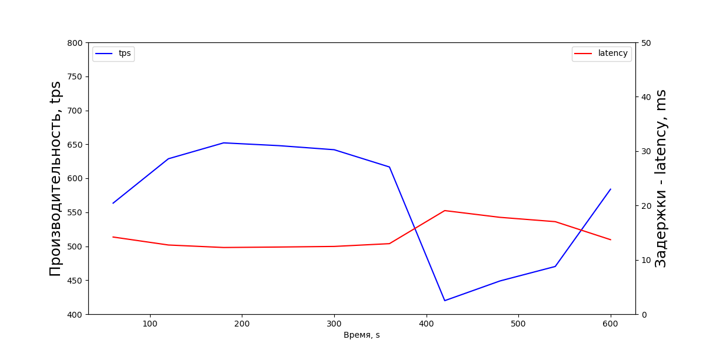
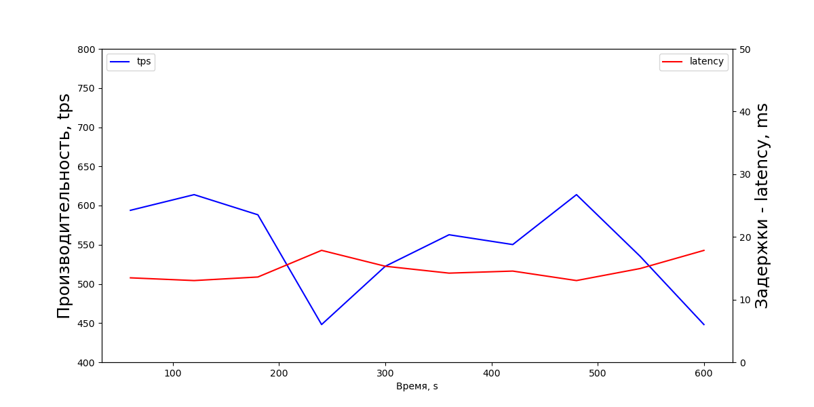
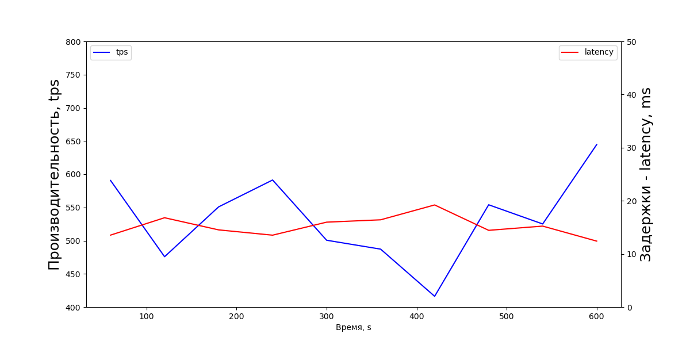
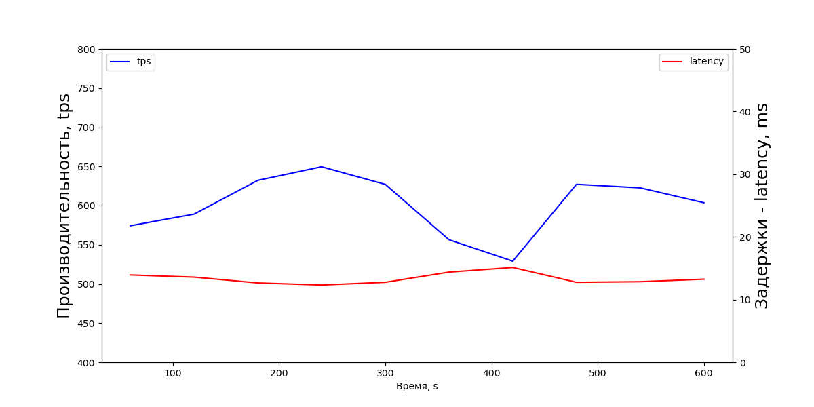
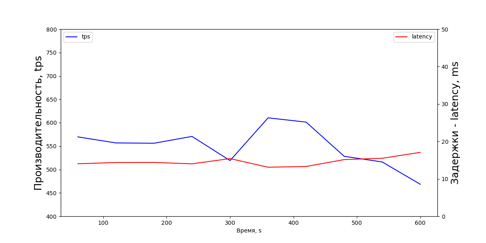
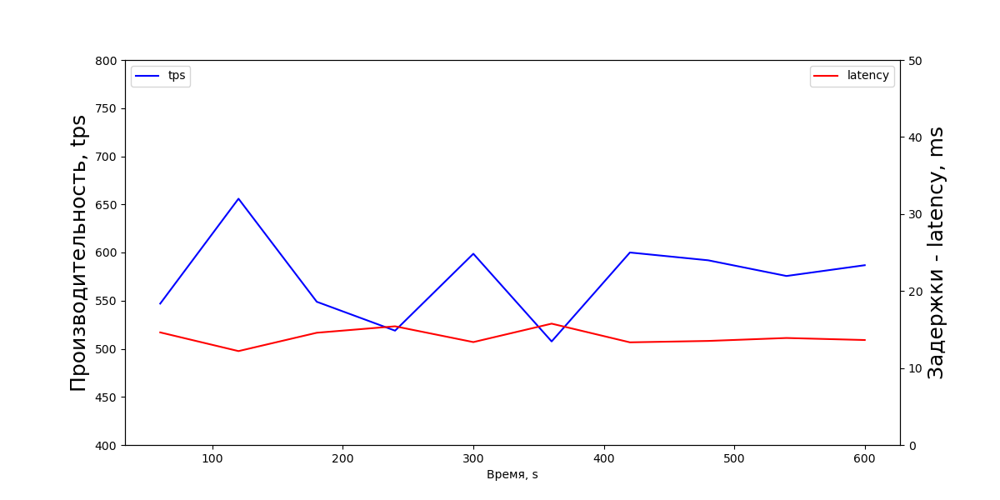
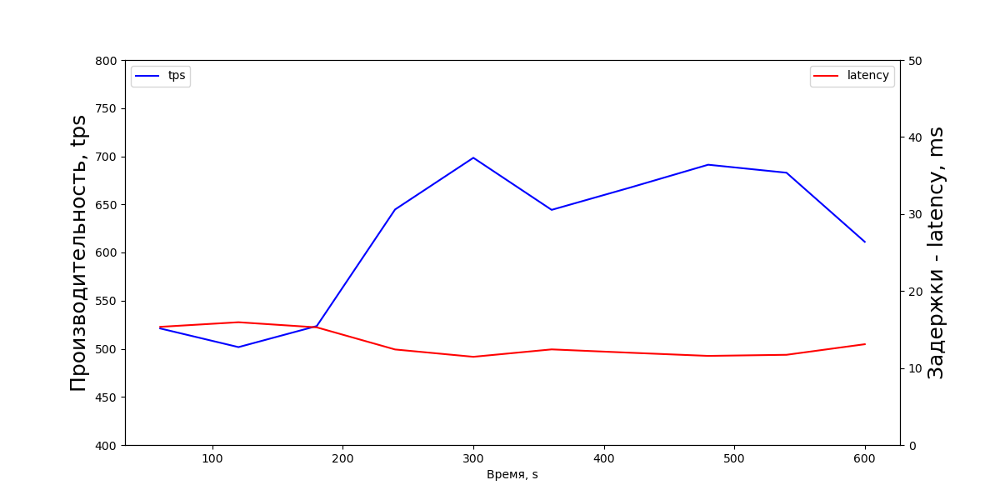

## MVCC, vacuum и autovacuum.

Графики строились специально написанным python скриптом [diagram.py](diagram.py), данные брались из текстового вывода команд в консоли.

1. Создаем ВМ на ЯО со следующими характеристиками:
```text
# OS Type: Ubuntu 22.04
# Total Memory (RAM): 4 GB
# CPUs num: 4
# Data Storage: hdd 20GB
```
Сразу обновим систему, выполнив команды:
```bash
devops0@otus-pg:~$ sudo apt update && sudo apt dist-upgrade -y
```

2. Устанавливаем PostgreSQL 14:
```bash
devops0@otus-pg:~$ sudo apt install postgresql-14 -y
...
devops0@otus-pg:~$ pg_lsclusters
Ver Cluster Port Status Owner    Data directory              Log file
14  main    5432 online postgres /var/lib/postgresql/14/main /var/log/postgresql/postgresql-14-main.log
```

3. Применим выданные настройки для кластера:
   - сохраним действующий файл настроек, на тот случай, если нужно будет оперативно вернуться к дефолтным настройкам:
    ```bash
    devops0@otus-pg:~$ sudo cp /etc/postgresql/14/main/postgresql.conf /etc/postgresql/14/main/postgresql.conf.back
    ```
   - для того, чтоб оставить только нужные параметры, удалим все закоментированные и пустые строки из файла настроек:
   - сохраним действующий файл настроек, на тот случай, если нужно будет оперативно вернуться к дефолтным настройкам:
    ```bash
    devops0@otus-pg:~$ sudo sed -i 's/^[ \t]*//g' /etc/postgresql/14/main/postgresql.conf
    devops0@otus-pg:~$ sudo sed -i '/^$/d' /etc/postgresql/14/main/postgresql.conf
    devops0@otus-pg:~$ sudo sed -i '/^#/d' /etc/postgresql/14/main/postgresql.conf
    ```
   - имеем следующие настройки:
   
   <details>
   <summary>Показать</summary>
   <p>

    #### cat /etc/postgresql/14/main/postgresql.conf
    
    ```bash
    data_directory = '/var/lib/postgresql/14/main'		# use data in another directory
    hba_file = '/etc/postgresql/14/main/pg_hba.conf'	# host-based authentication file
    ident_file = '/etc/postgresql/14/main/pg_ident.conf'	# ident configuration file
    external_pid_file = '/var/run/postgresql/14-main.pid'			# write an extra PID file
    port = 5432				# (change requires restart)
    
    unix_socket_directories = '/var/run/postgresql'	# comma-separated list of directories
    ssl = on
    ssl_cert_file = '/etc/ssl/certs/ssl-cert-snakeoil.pem'
    ssl_key_file = '/etc/ssl/private/ssl-cert-snakeoil.key'
    
    dynamic_shared_memory_type = posix	# the default is the first option
    log_line_prefix = '%m [%p] %q%u@%d '		# special values:
    log_timezone = 'Etc/UTC'
    cluster_name = '14/main'			# added to process titles if nonempty
    stats_temp_directory = '/var/run/postgresql/14-main.pg_stat_tmp'
    datestyle = 'iso, mdy'
    timezone = 'Etc/UTC'
    lc_messages = 'en_US.UTF-8'			# locale for system error message
    lc_monetary = 'en_US.UTF-8'			# locale for monetary formatting
    lc_numeric = 'en_US.UTF-8'			# locale for number formatting
    lc_time = 'en_US.UTF-8'				# locale for time formatting
    default_text_search_config = 'pg_catalog.english'
    include_dir = 'conf.d'			# include files ending in '.conf' from
    
    # Изменённые параметры.
    max_connections = 100 # <-- забыл изменить
    shared_buffers = 128MB # <-- забыл изменить
    effective_cache_size = 3GB
    maintenance_work_mem = 512MB
    checkpoint_completion_target = 0.9
    wal_buffers = 16MB
    default_statistics_target = 500
    random_page_cost = 4
    effective_io_concurrency = 2
    work_mem = 6553kB
    min_wal_size = 4GB
    max_wal_size = 16GB
    ```
    
    </p>
    
   </details>

    - перезагружаем кластер с применёнными настройками:
    ```bash
    devops0@otus-pg:~$ sudo service postgresql@14-main restart
    devops0@otus-pg:~$ pg_lsclusters
    Ver Cluster Port Status Owner    Data directory              Log file
    14  main    5432 online postgres /var/lib/postgresql/14/main /var/log/postgresql/postgresql-14-main.log
    ```
   
    - авторизуемся под админом postgres и запускаем тесты:
    ```bash
    devops0@otus-pg:~$ sudo -u postgres -i
    
    postgres@otus-pg:~$ pgbench -i postgres
    dropping old tables...
    NOTICE:  table "pgbench_accounts" does not exist, skipping
    NOTICE:  table "pgbench_branches" does not exist, skipping
    NOTICE:  table "pgbench_history" does not exist, skipping
    NOTICE:  table "pgbench_tellers" does not exist, skipping
    creating tables...
    generating data (client-side)...
    100000 of 100000 tuples (100%) done (elapsed 0.06 s, remaining 0.00 s)
    vacuuming...
    creating primary keys...
    done in 1.47 s (drop tables 0.13 s, create tables 0.40 s, client-side generate 0.40 s, vacuum 0.25 s, primary keys 0.28 s).
    
    postgres@otus-pg:~$ pgbench -c8 -P 60 -T 600 -U postgres postgres
    pgbench (14.7 (Ubuntu 14.7-0ubuntu0.22.04.1))
    starting vacuum...end.
    progress: 60.0 s, 563.4 tps, lat 14.191 ms stddev 13.372
    progress: 120.0 s, 628.7 tps, lat 12.724 ms stddev 11.156
    progress: 180.0 s, 652.1 tps, lat 12.264 ms stddev 10.351
    progress: 240.0 s, 648.0 tps, lat 12.350 ms stddev 10.354
    progress: 300.0 s, 642.0 tps, lat 12.461 ms stddev 10.331
    progress: 360.0 s, 616.6 tps, lat 12.972 ms stddev 11.774
    progress: 420.0 s, 419.9 tps, lat 19.053 ms stddev 16.255
    progress: 480.0 s, 448.9 tps, lat 17.813 ms stddev 16.360
    progress: 540.0 s, 470.2 tps, lat 17.018 ms stddev 14.613
    progress: 600.0 s, 583.9 tps, lat 13.704 ms stddev 11.827
    transaction type: <builtin: TPC-B (sort of)>
    scaling factor: 1
    query mode: simple
    number of clients: 8
    number of threads: 1
    duration: 600 s
    number of transactions actually processed: 340433
   
    latency average = 14.099 ms
    latency stddev = 12.692 ms
    initial connection time = 13.965 ms
    tps = 567.388584 (without initial connection time)
    ```
   
   #### Неверно заданные параметры.
    ```bash
    max_connections = 100 # <-- забыл изменить
    shared_buffers = 128MB # <-- забыл изменить
    effective_cache_size = 3GB
    maintenance_work_mem = 512MB
    checkpoint_completion_target = 0.9
    wal_buffers = 16MB
    default_statistics_target = 500
    random_page_cost = 4
    effective_io_concurrency = 2
    work_mem = 6553kB
    min_wal_size = 4GB
    max_wal_size = 16GB
     ```
   

    - после первого теста вспомнил, что не установил рекомендуемые значения - изменил их в /etc/postgresql/14/main/postgresql.conf, рестартанул сервер и запустил тест снова:
    ```bash
    postgres@otus-pg:~$ sudo nano /etc/postgresql/14/main/postgresql.conf
    
    max_connections = 40
    shared_buffers = 1GB
    
    postgres@otus-pg:~$ sudo service postgresql@14-main restart
    postgres@otus-pg:~$ pgbench -c8 -P 60 -T 600 -U postgres postgres
    pgbench (14.7 (Ubuntu 14.7-0ubuntu0.22.04.1))
    starting vacuum...end.
    progress: 60.0 s, 593.9 tps, lat 13.466 ms stddev 11.330
    progress: 120.0 s, 613.9 tps, lat 13.030 ms stddev 11.661
    progress: 180.0 s, 588.2 tps, lat 13.598 ms stddev 12.245
    progress: 240.0 s, 448.1 tps, lat 17.849 ms stddev 17.338
    progress: 300.0 s, 522.5 tps, lat 15.314 ms stddev 13.577
    progress: 360.0 s, 562.7 tps, lat 14.215 ms stddev 13.105
    progress: 420.0 s, 550.2 tps, lat 14.544 ms stddev 12.785
    progress: 480.0 s, 613.9 tps, lat 13.031 ms stddev 11.392
    progress: 540.0 s, 535.1 tps, lat 14.951 ms stddev 13.440
    progress: 600.0 s, 448.1 tps, lat 17.843 ms stddev 18.264
    transaction type: <builtin: TPC-B (sort of)>
    scaling factor: 1
    query mode: simple
    number of clients: 8
    number of threads: 1
    duration: 600 s
    number of transactions actually processed: 328601
    latency average = 14.607 ms
    latency stddev = 13.553 ms
    initial connection time = 14.015 ms
    tps = 547.647372 (without initial connection time)
    ```

   #### Рекомендуемые параметры.
    ```bash
    max_connections = 40
    shared_buffers = 1GB
    effective_cache_size = 3GB
    maintenance_work_mem = 512MB
    checkpoint_completion_target = 0.9
    wal_buffers = 16MB
    default_statistics_target = 500
    random_page_cost = 4
    effective_io_concurrency = 2
    work_mem = 6553kB
    min_wal_size = 4GB
    max_wal_size = 16GB
     ```
   


4. Настраиваем autovacuum:
    - применим рекомендуемые на лекции параметры и запускаем тест снова:
   #### Тест 1.
    ```bash
    autovacuum = on
    log_autovacuum_min_duration = 0
    autovacuum_max_workers = 2
    autovacuum_naptime = 15s
    autovacuum_vacuum_threshold = 25
    autovacuum_vacuum_scale_factor = 0.05
    autovacuum_vacuum_cost_delay = 10
    autovacuum_vacuum_cost_limit = 1000
    ```
   
    ```bash
    postgres@otus-pg:~$ pgbench -c8 -P 60 -T 600 -U postgres postgres
    pgbench (14.7 (Ubuntu 14.7-0ubuntu0.22.04.1))
    starting vacuum...end.
    progress: 60.0 s, 590.6 tps, lat 13.540 ms stddev 12.053
    progress: 120.0 s, 475.8 tps, lat 16.811 ms stddev 15.002
    progress: 180.0 s, 550.8 tps, lat 14.526 ms stddev 14.160
    progress: 240.0 s, 591.3 tps, lat 13.529 ms stddev 12.136
    progress: 300.0 s, 500.6 tps, lat 15.978 ms stddev 15.606
    progress: 360.0 s, 487.2 tps, lat 16.421 ms stddev 15.054
    progress: 420.0 s, 416.2 tps, lat 19.219 ms stddev 18.371
    progress: 480.0 s, 554.0 tps, lat 14.440 ms stddev 13.104
    progress: 540.0 s, 525.1 tps, lat 15.236 ms stddev 14.136
    progress: 600.0 s, 644.6 tps, lat 12.411 ms stddev 9.415
    transaction type: <builtin: TPC-B (sort of)>
    scaling factor: 1
    query mode: simple
    number of clients: 8
    number of threads: 1
    duration: 600 s
    number of transactions actually processed: 320178
    latency average = 14.991 ms
    latency stddev = 13.947 ms
    initial connection time = 14.562 ms
    tps = 533.623535 (without initial connection time)
    ```
   

    - как видим, что до идеала далеко, пробуем дальше:
   #### Тест 2.
    ```bash
    autovacuum = on
    log_autovacuum_min_duration = 0
    autovacuum_max_workers = 4 # изменим, ориентируясь на кол-во CPU.
    autovacuum_naptime = 15s
    autovacuum_vacuum_threshold = 25
    autovacuum_vacuum_scale_factor = 0.05
    autovacuum_vacuum_cost_delay = 5ms # уменьшим задержку при превышении предела стоимости
    autovacuum_vacuum_cost_limit = 500 # уменьшим предел стоимости
    ```
    ```bash
    postgres@otus-pg:~$ pgbench -c8 -P 60 -T 600 -U postgres postgres
    pgbench (14.7 (Ubuntu 14.7-0ubuntu0.22.04.1))
    starting vacuum...end.
    progress: 60.0 s, 574.2 tps, lat 13.927 ms stddev 11.762
    progress: 120.0 s, 589.1 tps, lat 13.580 ms stddev 11.554
    progress: 180.0 s, 632.2 tps, lat 12.652 ms stddev 10.092
    progress: 240.0 s, 649.5 tps, lat 12.319 ms stddev 10.878
    progress: 300.0 s, 627.0 tps, lat 12.757 ms stddev 11.159
    progress: 360.0 s, 556.3 tps, lat 14.381 ms stddev 12.442
    progress: 420.0 s, 529.0 tps, lat 15.121 ms stddev 13.805
    progress: 480.0 s, 627.1 tps, lat 12.757 ms stddev 10.642
    progress: 540.0 s, 622.6 tps, lat 12.849 ms stddev 10.834
    progress: 600.0 s, 603.6 tps, lat 13.255 ms stddev 11.540
    transaction type: <builtin: TPC-B (sort of)>
    scaling factor: 1
    query mode: simple
    number of clients: 8
    number of threads: 1
    duration: 600 s
    number of transactions actually processed: 360634
    latency average = 13.309 ms
    latency stddev = 11.485 ms
    initial connection time = 14.929 ms
    tps = 601.054155 (without initial connection time)
    ```
   

    - уже лучше, среднее значение производительности увеличилось (533.623535->601.054155), а задержки снизились (14.991->13.309), продолжаем:
   #### Тест 3.
    ```bash
    autovacuum = on
    log_autovacuum_min_duration = -1 # отключим логирование
    autovacuum_max_workers = 3 # по умолчанию
    autovacuum_naptime = 5s
    autovacuum_vacuum_threshold = 25
    autovacuum_vacuum_scale_factor = 0.05
    autovacuum_vacuum_cost_delay = 5ms
    autovacuum_vacuum_cost_limit = 500
    ```
    ```bash
    postgres@otus-pg:~$ pgbench -c8 -P 60 -T 600 -U postgres postgres
    pgbench (14.7 (Ubuntu 14.7-0ubuntu0.22.04.1))
    starting vacuum...end.
    progress: 60.0 s, 569.7 tps, lat 14.036 ms stddev 13.394
    progress: 120.0 s, 556.8 tps, lat 14.365 ms stddev 13.627
    progress: 180.0 s, 556.1 tps, lat 14.387 ms stddev 13.240
    progress: 240.0 s, 570.7 tps, lat 14.016 ms stddev 12.406
    progress: 300.0 s, 519.1 tps, lat 15.408 ms stddev 14.275
    progress: 360.0 s, 610.4 tps, lat 13.108 ms stddev 11.418
    progress: 420.0 s, 601.3 tps, lat 13.301 ms stddev 11.847
    progress: 480.0 s, 528.2 tps, lat 15.146 ms stddev 12.640
    progress: 540.0 s, 516.1 tps, lat 15.501 ms stddev 13.864
    progress: 600.0 s, 468.4 tps, lat 17.079 ms stddev 15.514
    transaction type: <builtin: TPC-B (sort of)>
    scaling factor: 1
    query mode: simple
    number of clients: 8
    number of threads: 1
    duration: 600 s
    number of transactions actually processed: 329821
    latency average = 14.553 ms
    latency stddev = 13.240 ms
    initial connection time = 14.915 ms
    tps = 549.702611 (without initial connection time)
    ```
   

    - среднее значение производительности упало (601.054155->549.702611) и выросли задержки (13.309->14.553), продолжаем:
   #### Тест 4.
    ```bash
    autovacuum = on
    log_autovacuum_min_duration = -1
    autovacuum_max_workers = 2 # возьмем по половине от доступных CPU
    autovacuum_naptime = 15s
    autovacuum_vacuum_threshold = 25
    autovacuum_vacuum_scale_factor = 0.05
    autovacuum_vacuum_cost_delay = 15ms # попробуем увеличить задержку
    autovacuum_vacuum_cost_limit = 1000 # установим по рекомендации преподавателя
    ```
    ```bash
    postgres@otus-pg:~$ pgbench -c8 -P 60 -T 600 -U postgres postgres
    pgbench (14.7 (Ubuntu 14.7-0ubuntu0.22.04.1))
    starting vacuum...end.
    progress: 60.0 s, 546.9 tps, lat 14.623 ms stddev 13.675
    progress: 120.0 s, 655.9 tps, lat 12.196 ms stddev 10.216
    progress: 180.0 s, 548.8 tps, lat 14.578 ms stddev 13.734
    progress: 240.0 s, 518.8 tps, lat 15.415 ms stddev 15.686
    progress: 300.0 s, 598.7 tps, lat 13.365 ms stddev 12.176
    progress: 360.0 s, 507.6 tps, lat 15.760 ms stddev 16.042
    progress: 420.0 s, 600.0 tps, lat 13.333 ms stddev 11.566
    progress: 480.0 s, 591.9 tps, lat 13.515 ms stddev 11.458
    progress: 540.0 s, 575.6 tps, lat 13.897 ms stddev 11.930
    progress: 600.0 s, 586.8 tps, lat 13.634 ms stddev 11.216
    transaction type: <builtin: TPC-B (sort of)>
    scaling factor: 1
    query mode: simple
    number of clients: 8
    number of threads: 1
    duration: 600 s
    number of transactions actually processed: 343867
    latency average = 13.958 ms
    latency stddev = 12.813 ms
    initial connection time = 14.502 ms
    tps = 573.109994 (without initial connection time)
    ```
   

    - среднее значение производительности немного выросло (549.702611->573.109994) и снизились задержки (14.553->13.958). Наиболее приемлемые показатели были при Тесте 2, вернёмся к их параметрам, немного подправив:
   #### Тест 5.
    ```bash
    autovacuum = on
    log_autovacuum_min_duration = 0 
    autovacuum_max_workers = 2 # возьмем по половине от доступных CPU
    autovacuum_naptime = 15s
    autovacuum_vacuum_threshold = 25
    autovacuum_vacuum_scale_factor = 0.05
    autovacuum_vacuum_cost_delay = 5ms
    autovacuum_vacuum_cost_limit = 500
    ```
    ```bash
    postgres@otus-pg:~$ pgbench -c8 -P 60 -T 600 -U postgres postgres
    pgbench (14.7 (Ubuntu 14.7-0ubuntu0.22.04.1))
    starting vacuum...end.
    progress: 60.0 s, 521.1 tps, lat 15.346 ms stddev 13.142
    progress: 120.0 s, 501.7 tps, lat 15.944 ms stddev 15.041
    progress: 180.0 s, 523.6 tps, lat 15.278 ms stddev 13.821
    progress: 240.0 s, 644.7 tps, lat 12.407 ms stddev 9.836
    progress: 300.0 s, 698.4 tps, lat 11.455 ms stddev 8.937
    progress: 360.0 s, 644.3 tps, lat 12.417 ms stddev 9.695
    progress: 420.0 s, 667.4 tps, lat 11.985 ms stddev 9.959
    progress: 480.0 s, 691.2 tps, lat 11.573 ms stddev 9.298
    progress: 540.0 s, 682.9 tps, lat 11.715 ms stddev 9.957
    progress: 600.0 s, 611.1 tps, lat 13.088 ms stddev 12.081
    transaction type: <builtin: TPC-B (sort of)>
    scaling factor: 1
    query mode: simple
    number of clients: 8
    number of threads: 1
    duration: 600 s
    number of transactions actually processed: 371197
    latency average = 12.931 ms
    latency stddev = 11.232 ms
    initial connection time = 14.647 ms
    tps = 618.639497 (without initial connection time)
    ```
   

5. Судя по средним значениям, лучшие настройки для текущих условий в тесте 5. "Уровнять" значение tps не удалось ни в одном из тестов, возможно при проведение более длительных тестов, график tps будет ровнее.
    